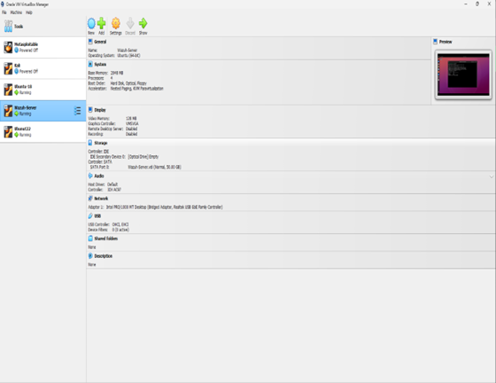
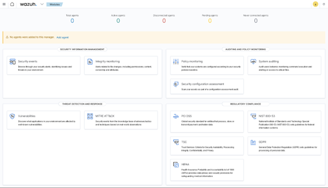
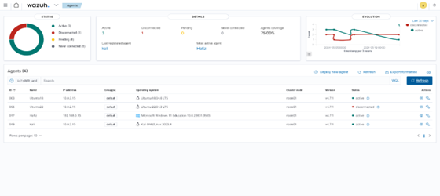

# 🛡 Wazuh Lab Environment

This project demonstrates how to deploy a **Wazuh SIEM lab** in a local virtual environment.
It’s a minimal but realistic simulation of a small enterprise network with one Wazuh server and multiple agents.
Perfect for hands-on practice, testing security detections, and learning Wazuh inside out.

---

## 🚀 Project Overview

- **1 Wazuh Server** (Ubuntu 22.04 LTS)
- **3 Agent Machines** (Ubuntu 18.04, Ubuntu 22.04, Kali Linux)
- Bridged network between all machines
- Centralized monitoring via Wazuh dashboard
- Inventory, security events, and agent management in one place.

---

## 🧱 Lab Architecture



| Role          | OS                | Description                              |
|---------------|-------------------|-------------------------------------------|
| Wazuh Server  | Ubuntu 22.04 LTS  | Indexer, server, dashboard                |
| Agent 1       | Ubuntu 18.04 LTS  | Endpoint to monitor                       |
| Agent 2       | Ubuntu 22.04 LTS  | Endpoint to monitor                       |
| Agent 3       | Kali Linux 2023   | Security testing endpoint                 |
| Host          | Windows 11        | Optional extra agent                      |

---

## 🧰 What You Need

- Oracle VirtualBox
- Ubuntu 22.04 ISO
- At least 8 GB RAM and 4 cores (total across VMs)
- Internet connection

---

## 🪜 Setup Guide

### 1. Create Virtual Machines
- Create one Ubuntu 22.04 VM for the Wazuh server
- Create three agent VMs (Ubuntu 18.04, Ubuntu 22.04, Kali)
- Set **network to Bridged Adapter** for all

### 2. Install Wazuh Server
Run the one-line official install command on the server:
```
curl -sO https://packages.wazuh.com/4.13/wazuh-install.sh && sudo bash ./wazuh-install.sh -a
```
Wait for it to finish and note the dashboard URL and credentials.

### 3. Access the Dashboard
Visit:
```
https://<server-ip>
```
Accept the self-signed certificate and log in.

### 4. Add Agents
- From the dashboard, go to **Agents → Deploy new agent**
- Select OS and server IP
- Copy the generated command and run it on the agent machine
- Start the Wazuh agent service
- Refresh the dashboard to see the agent appear.

---

## 🧪 Verification

- Check service status on the agent:
```
sudo systemctl status wazuh-agent
```
- Go to the dashboard and confirm all agents show up as “active”
- Monitor alerts, inventory, and processes in real time.

---

## 📸 Screenshots

> Replace the placeholder images in `./docs` with your real screenshots.

| Dashboard | Agent List |
|-----------|------------|
|  |  |

---

## ⚡ Optional Enhancements

- Add Windows or macOS agents for more variety
- Connect Syscollector to monitor system inventory
- Add security detection rules to simulate incidents
- Document your detection results in `/docs`.

---

## 🧑 Author

**Hafiz Javid**  
[Portfolio](https://hafizkh.dev) • [Wazuh Profile](https://wazuh.com/ambassadors/hafiz-javid/)

---

## 🏷 Tags

`Wazuh` `SIEM` `XDR` `Cybersecurity` `Virtualization` `Ubuntu` `Kali Linux`