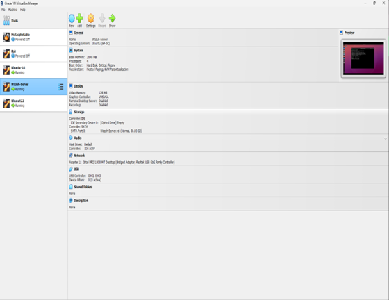
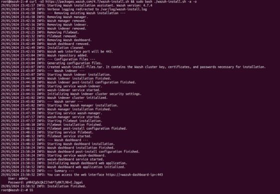
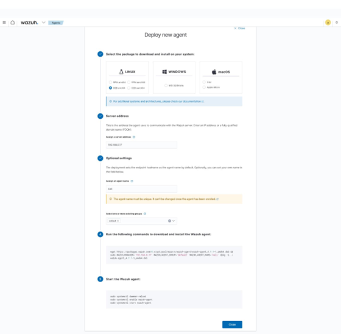
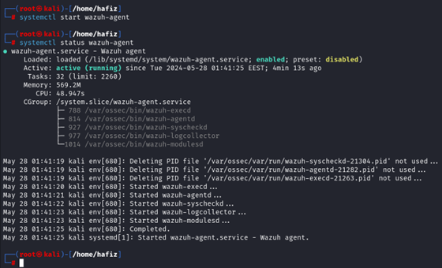
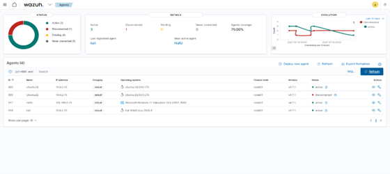

# 🛡 Deploying a Wazuh Lab in Virtual Environment

A step-by-step tutorial for setting up a Wazuh SIEM lab on a single host using virtual machines, deploying agents across multiple operating systems, and verifying connectivity through the Wazuh dashboard.

[Wazuh Home](https://wazuh.com/?utm_source=ambassadors&utm_medium=referral&utm_campaign=ambassadors%20program) ·
[Wazuh Ambassador Program](https://wazuh.com/ambassadors-program/?utm_source=ambassadors&utm_medium=referral&utm_campaign=ambassadors+program) ·
[Portfolio](https://hafizkh.dev/)

---

## 📑 Table of Contents
1. [Preparing the Virtual Environment](#1-preparing-the-virtual-environment)
2. [Installing the Wazuh Server](#2-installing-the-wazuh-server)
3. [Accessing the Wazuh Dashboard](#3-accessing-the-wazuh-dashboard)
4. [Deploying Wazuh Agents via the Dashboard](#4-deploying-wazuh-agents-via-the-dashboard)
5. [Verifying Agent Registration](#5-verifying-agent-registration)
6. [Restarting the Wazuh Services](#6-restarting-the-wazuh-services)

---

## 1. Preparing the Virtual Environment

Before installing Wazuh, you need an environment that mirrors a small network. I used **Oracle VM VirtualBox** to create four virtual machines: one acts as the Wazuh server and the other three act as agents. The machines are connected via a bridged network so they can communicate as if they were on the same LAN.

Figure 1 shows the virtual environment: three Ubuntu machines and one Kali machine, with the server running Ubuntu 22.04 LTS and the agents running Ubuntu 18.04 LTS, Ubuntu 22.04 LTS and Kali Linux 2023.4; the host Windows 11 system serves as an additional agent.


*Figure 1: Virtual Environment of Ubuntu machines*

| Role          | OS                | Description                              |
|---------------|-------------------|-------------------------------------------|
| Wazuh Server  | Ubuntu 22.04 LTS  | Indexer, server, dashboard                |
| Agent 1       | Ubuntu 18.04 LTS  | Endpoint to monitor                       |
| Agent 2       | Ubuntu 22.04 LTS  | Endpoint to monitor                       |
| Agent 3       | Kali Linux 2023.4 | Security testing endpoint                 |
| Host          | Windows 11        | Optional extra agent                      |

> **Tip:** Configure each VM with a bridged network adapter so they obtain IP addresses on the same subnet as your host. This makes it simple for the server and agents to reach each other.

---

## 2. Installing the Wazuh Server

Wazuh consists of three components: the **indexer**, the **server/manager** and the **dashboard**. While you can install each component manually, in this guide the recommended approach is to use the single-command installation script provided by Wazuh, which automates downloading and configuring all components. On your Ubuntu 22.04 server VM, run the following command as root:

```bash
curl -sO https://packages.wazuh.com/4.13/wazuh-install.sh && sudo bash ./wazuh-install.sh -a
```

**Code Snippet 1: Wazuh server installation command**

This script cleans any previous installation, adds the Wazuh package repository, installs the indexer, manager and dashboard, and outputs credentials for the dashboard. The `-a` flag accepts the licence agreement; the optional `-o` flag overwrites an existing installation. You can use the `-o` flag if you have an existing or partially installed Wazuh setup.


*Figure 2: Completion of Wazuh installation*

When the installation completes, note the URL and credentials printed in the terminal -- you'll need them to log into the dashboard. To determine the IP address of your server, run:

```bash
ip a
```

**Code Snippet 2: Check server IP address**

Look for the address on your bridged interface. For example, if the server's IP is `192.168.0.17` then your dashboard will be available at `https://192.168.0.17`.

---

## 3. Accessing the Wazuh Dashboard

Open a web browser on your host or VM and navigate to the URL displayed after installation. Accept the self-signed certificate warning if prompted, then log in using the username and password provided by the installer. The dashboard opens to an overview page showing SIEM, XDR, regulatory compliance and other modules. Since no agents have been deployed yet, the "Agents" section will show **zero** active agents.


*Figure 3: Wazuh dashboard with no agents*

---

## 4. Deploying Wazuh Agents via the Dashboard

You can add agents from the **Agents** section of the dashboard. There are two deployment methods: using the web interface or using the `manage_agents` script on the server. The web interface is straightforward and will be used here.

From the **Agents** page, click **Deploy new agent**. A form appears prompting you to select the operating system, enter the server address, optionally set a name and group, and then run generated commands on the client machine. For a Linux agent (e.g. Kali), choose the **Deb** package, enter the server's IP (`192.168.0.17` in the example), and accept the default group. The wizard will generate a single shell command that downloads and installs the agent, and it also provides systemd commands to start the service.


*Figure 4: Details of newly deployed agents*

Run the installation command on the agent VM's terminal as root. After installation, enable and start the agent service using the systemd commands shown in the wizard. For example:

```bash
sudo systemctl daemon-reload
sudo systemctl enable wazuh-agent
sudo systemctl start wazuh-agent
sudo systemctl status wazuh-agent
```

**Code Snippet 3: Enable and start the Wazuh agent**

The last command should report `active (running)`. If it doesn't, check that the manager IP is correct in the agent's configuration file (`/var/ossec/etc/ossec.conf`). Root privileges are required for these steps.


*Figure 5: Status of the Wazuh agent*

Repeat the deployment process for the other agent VMs. Wazuh provides installers for Windows and macOS as well. When deploying the Windows agent, choose the **MSI 64-bit** package from the wizard, enter the server address and download the installer. After running the MSI on your Windows machine, start the Wazuh agent service from the Services app or by running `NET START Wazuh` as administrator.

---

## 5. Verifying Agent Registration

Once each agent service is running, return to the **Agents** page in the dashboard and click **Refresh**. The new agents should appear in the list with green status indicators. The ID, name, IP address and operating system of each agent will be displayed. If an agent appears as **disconnected**, ensure that the service is running on the endpoint and that the `ossec.conf` file contains the correct manager IP.


*Figure 6: Deployed agents in the Wazuh dashboard*

Hover over the status icon to see details or click the eye icon in the **Actions** column to open the agent detail page.

---

## 6. Restarting the Wazuh Services

Occasionally you may need to restart the Wazuh indexer and manager to apply configuration changes. On the server VM, run the following commands:

```bash
sudo systemctl daemon-reload
sudo systemctl enable wazuh-indexer
sudo systemctl start wazuh-indexer
sudo systemctl restart wazuh-manager
```

**Code Snippet 4: Restart Wazuh services on the server**

These commands reload systemd configuration, enable and start the indexer and restart the manager. After a restart, wait a moment and then refresh the dashboard to confirm that all services are running and agents reconnect.

---

## 📥 Download the Full Tutorial (PDF)

[👉 Download PDF](./Deploying%20the%20Wazuh%20Lab.pdf)

---

## 🛰 Follow the Wazuh Weekly Tutorials

This guide is part of the **Wazuh Weekly Tutorials** series to help you implement and understand real security use cases.

---

## 👤 Connect with Me

- [LinkedIn – Hafiz Javid](https://www.linkedin.com/in/hafiz-javid/)
- [Portfolio – hafizkh.dev](https://hafizkh.dev/)
